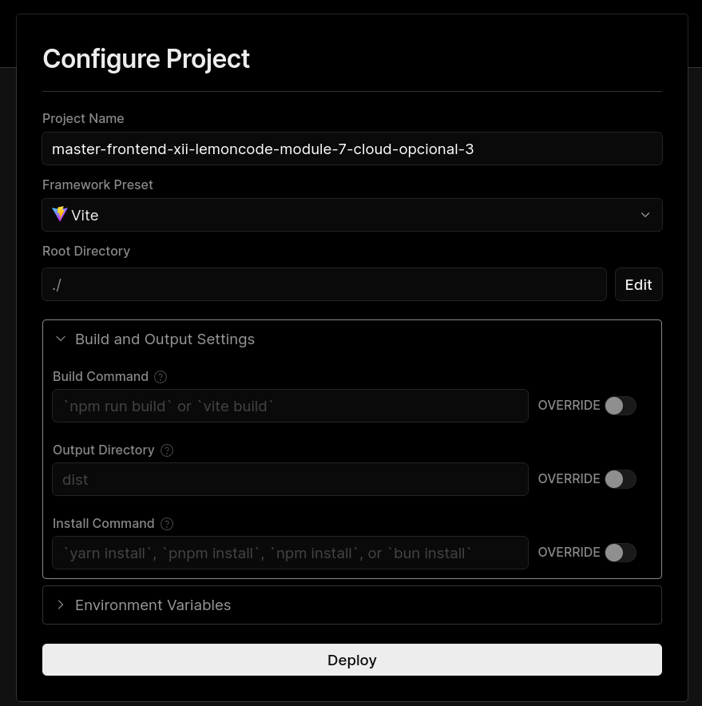
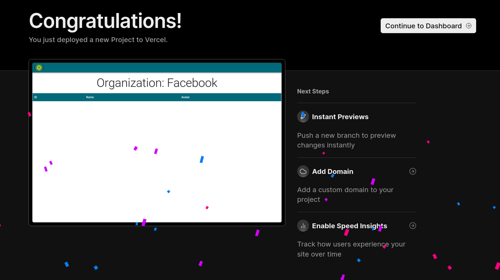
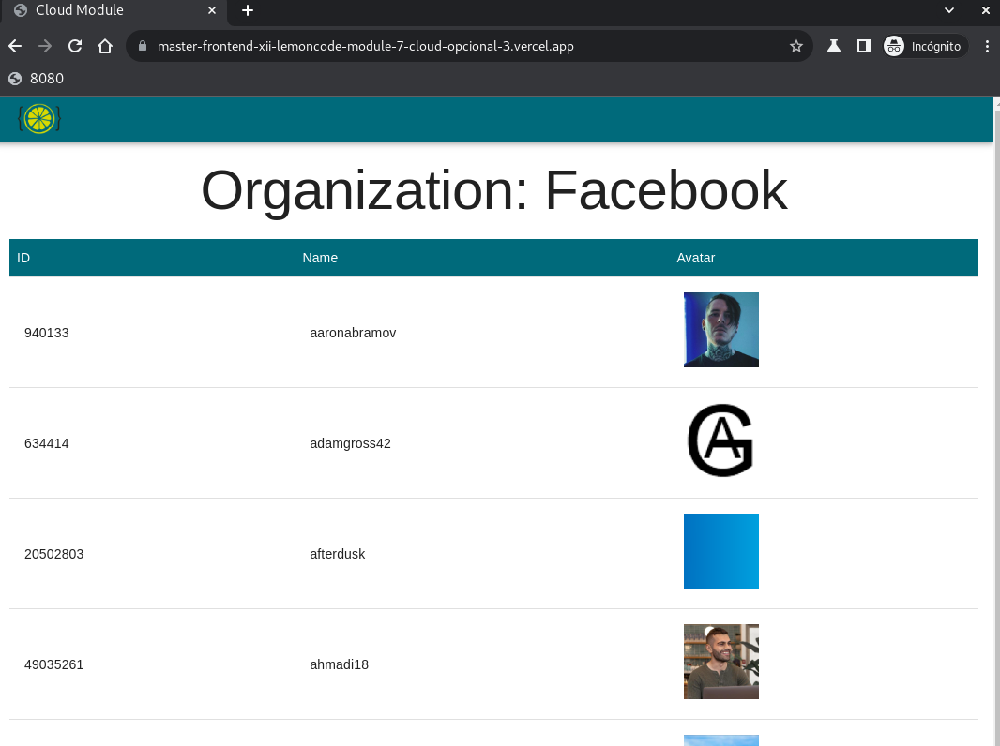

# Master Frontend XII Lemoncode 🍋

## Module 7 CLOUD

### opcional parte 3

 

[Go back - Index](https://github.com/MiguelJiRo/Master-Frontend-XII-Lemoncode)

 

 

### Parte opcional - 3

<ol>
    <li>✅ Desplegar aplicación front de forma automática en Vercel.</li>
</ol>

Para el desarrollo de esta parte se ha partido del ejemplo de: https://github.com/Lemoncode/master-frontend-lemoncode/tree/master/07-cloud/99-bonus/01-vercel

 

 

